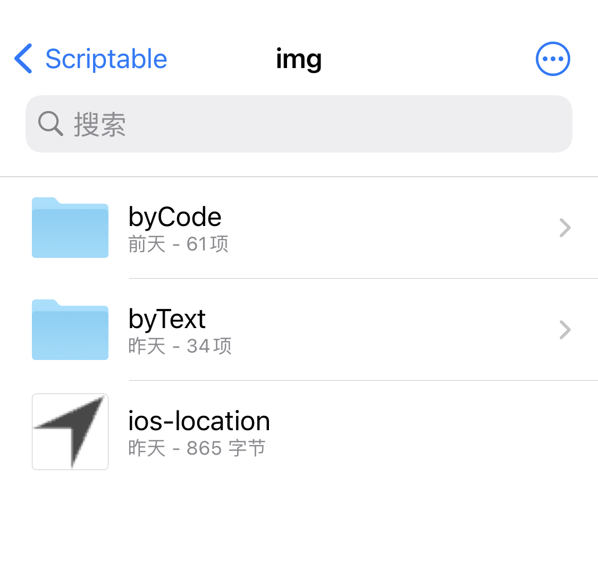

# 脚本使用说明

## qweather 和风天气

复制 `qweather-和风天气.js` 的内容，按照里面的提示进行操作

1. `baiduMapApiKey` : 百度地图 api，用于从经纬度获取所在地点（Scriptable 提供的 api 只有经纬度等信息）；[官网](http://lbsyun.baidu.com/)
2. `qweatherApiKey`: 和风天气 api，用于获取天气，[官网](https://dev.qweather.com/)
3. 另外要在 iCloud 的 Scriptable 文件夹下创建 `img/byCode/` 文件夹，用于存放天气图标文件，[下载链接](https://github.com/qwd/WeatherIcon)
4. `ios-location` 图标用于在地点边上显示一个导航箭头，放在 `img/` 文件夹下即可

网上也有公开的 api 也可以用，可以自己修改一下，相对而言，上述需要申请的 api 会稳定一点。